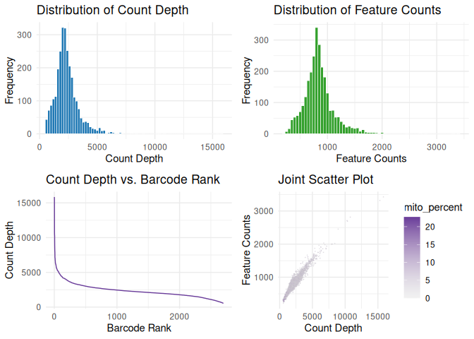
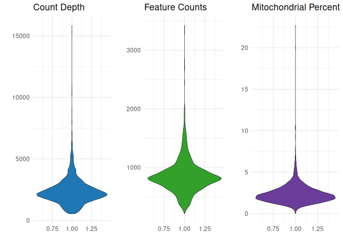
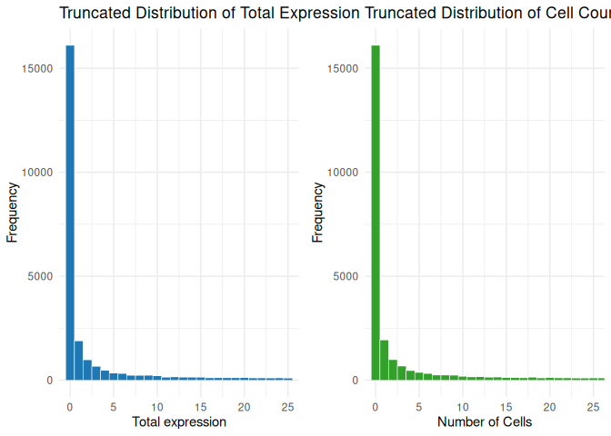
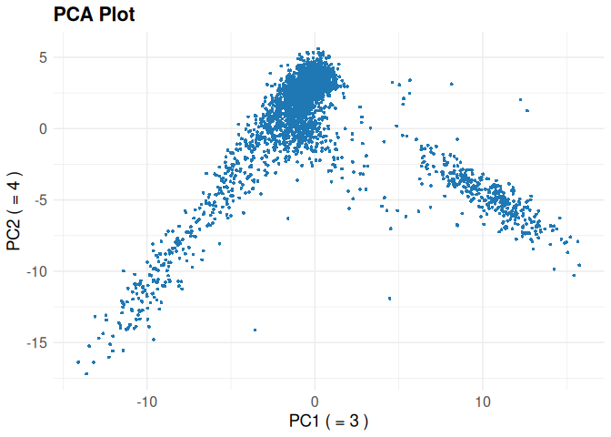
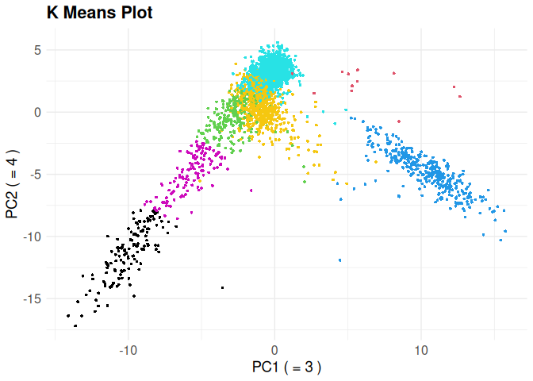

<!-- README.md is generated from README.Rmd. Please edit that file -->

# cellustering

<!-- badges: start -->
<!-- badges: end -->

The cellustering is a toolkit designed for the preprocessing and
clustering analysis of single-cell RNA sequencing (scRNA-seq) data.

## Installation

You can install the development version of cellustering from
[GitHub](https://github.com/) with:

``` r
# install.packages("devtools")
devtools::install_github("langshangyuan/cellustering")
```

## Example

This is a basic example which shows you how to create plots to
facilitate quality control:

``` r
library(cellustering)
#> 
#> Attaching package: 'cellustering'
#> The following object is masked from 'package:stats':
#> 
#>     kmeans
## basic example code
pbmc <- read_10x(cellustering_example("hg19"))
pbmc <- qc_plot(pbmc)
```



``` r
head(pbmc@quality$cell)
#>                  count_depth feature_count mito_percent
#> AAACATACAACCAC.1        2421           781     3.097893
#> AAACATTGAGCTAC.1        4903          1352     3.875178
#> AAACATTGATCAGC.1        3149          1131     1.079708
#> AAACCGTGCTTCCG.1        2639           960     1.970443
#> AAACCGTGTATGCG.1         981           522     1.427115
#> AAACGCACTGGTAC.1        2164           782     1.940850
head(pbmc@quality$feature)
#>              total_expression cell_count
#> MIR1302.10                  0          0
#> FAM138A                     0          0
#> OR4F5                       0          0
#> RP11.34P13.7                0          0
#> RP11.34P13.8                0          0
#> AL627309.1                  9          9
pbmc@quality$cell_plot
```


``` r
pbmc@quality$violin_plot
```



``` r
pbmc@quality$feature_plot
```



After we perform the preprocessing steps like filter, normalize, we can
call the `Cellustering` package to find the High Variation Genes,
perform principal component analysis, and call a clustering method.

``` r
pbmc <- qc_filter(pbmc,
  min_feature = 200,
  max_feature = 2500,
  max_mito_percent = 5,
  min_cell = 3
)
pbmc <- normalize(pbmc, scale_factor = 1e6, log_transformation = TRUE)
pbmc <- find_HVG(pbmc, n_feature = 2000, loess_span = 0.5)
#> Warning in sqrt(predicted_vars): NaNs produced
pbmc <- scale_data(pbmc)
pbmc <- principal_component_analysis(pbmc, PC1 = 3, PC2 = 4)
```



``` r
pbmc <- kmeans(pbmc, k = 7, dimensions = 4)
```


